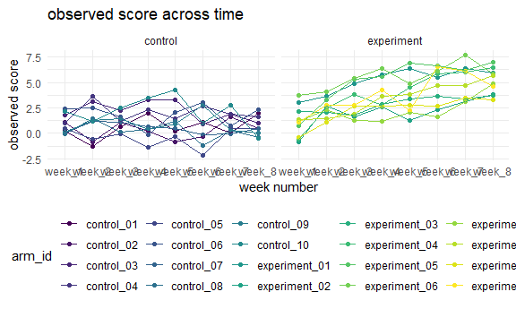

p8105\_hw5\_xl3141
================
Xinyuan Liu
11/16/2021

## Set up

``` r
library(tidyverse)
```

    ## -- Attaching packages --------------------------------------- tidyverse 1.3.1 --

    ## v ggplot2 3.3.5     v purrr   0.3.4
    ## v tibble  3.1.4     v dplyr   1.0.7
    ## v tidyr   1.1.3     v stringr 1.4.0
    ## v readr   2.0.1     v forcats 0.5.1

    ## -- Conflicts ------------------------------------------ tidyverse_conflicts() --
    ## x dplyr::filter() masks stats::filter()
    ## x dplyr::lag()    masks stats::lag()

``` r
library(ggplot2)

knitr::opts_chunk$set(
  fig.width = 6,
  fig.asp = .6,
  out.width = "90%"
)

theme_set(theme_minimal() + theme(legend.position = "bottom"))

options(
  ggplot2.continuous.colour = "viridis",
  ggplot2.continuous.fill = "viridis"
)

scale_colour_discrete = scale_colour_viridis_d
scale_fill_discrete = scale_fill_viridis_d
```

## Problem 1

``` r
homocide_df =
  read_csv("data-homicides-master/homicide-data.csv", na = c("", "Unknown")) %>% 
  mutate(
    city_state = str_c(city, state),
    resolution =case_when(
      disposition == "Closed without arrest" ~ "unsolved",
      disposition == "Open/No arrest" ~ "unsolved",
      disposition == "Closed by arrest" ~ "solved"
    )) %>% 
  relocate(city_state) %>% 
  filter(city_state != "TulsaAL")
```

    ## Rows: 52179 Columns: 12

    ## -- Column specification --------------------------------------------------------
    ## Delimiter: ","
    ## chr (8): uid, victim_last, victim_first, victim_race, victim_sex, city, stat...
    ## dbl (4): reported_date, victim_age, lat, lon

    ## 
    ## i Use `spec()` to retrieve the full column specification for this data.
    ## i Specify the column types or set `show_col_types = FALSE` to quiet this message.

``` r
homocide_df %>% 
  count(city_state, resolution)
```

    ## # A tibble: 100 x 3
    ##    city_state    resolution     n
    ##    <chr>         <chr>      <int>
    ##  1 AlbuquerqueNM solved       232
    ##  2 AlbuquerqueNM unsolved     146
    ##  3 AtlantaGA     solved       600
    ##  4 AtlantaGA     unsolved     373
    ##  5 BaltimoreMD   solved      1002
    ##  6 BaltimoreMD   unsolved    1825
    ##  7 Baton RougeLA solved       228
    ##  8 Baton RougeLA unsolved     196
    ##  9 BirminghamAL  solved       453
    ## 10 BirminghamAL  unsolved     347
    ## # ... with 90 more rows

let’s focus on Baltimore

``` r
baltimore_df =
  homocide_df %>% 
  filter(city_state == "BaltimoreMD")

baltimore_summary =
  baltimore_df %>% 
    summarize(
      unsolved = sum(resolution == "unsolved"),
      n = n()
    )

baltimore_test = 
  prop.test(
    x = baltimore_summary %>% pull(unsolved),
    n = baltimore_summary %>% pull(n)
  )

baltimore_test %>% 
  broom::tidy() %>% 
  select(estimate, contains("conf"))
```

    ## # A tibble: 1 x 3
    ##   estimate conf.low conf.high
    ##      <dbl>    <dbl>     <dbl>
    ## 1    0.646    0.628     0.663

function

``` r
prop_test_function = function(city_df){
  
  city_summary =
    city_df %>% 
      summarize(
        unsolved = sum(resolution == "unsolved"),
        n = n()
      )

  city_test = 
    prop.test(
      x = city_summary %>% pull(unsolved),
      n = city_summary %>% pull(n)
    )
  
  return(city_test)
}

prop_test_function(baltimore_df)
```

    ## 
    ##  1-sample proportions test with continuity correction
    ## 
    ## data:  city_summary %>% pull(unsolved) out of city_summary %>% pull(n), null probability 0.5
    ## X-squared = 239.01, df = 1, p-value < 2.2e-16
    ## alternative hypothesis: true p is not equal to 0.5
    ## 95 percent confidence interval:
    ##  0.6275625 0.6631599
    ## sample estimates:
    ##         p 
    ## 0.6455607

iterate across all cities

``` r
result_df =
  homocide_df%>% 
    nest(data = uid:resolution) %>% 
    mutate(
      test_results = map(data, prop_test_function),
      tidy_results = map(test_results, broom::tidy)
    ) %>% 
  select(city_state, tidy_results) %>% 
  unnest(tidy_results) %>% 
  select(city_state, estimate, contains("conf"))
```

plot of estimate and confidence interval

``` r
result_df %>% 
  mutate(city_state = fct_reorder(city_state, estimate)) %>%
  ggplot(aes(x = city_state, y = estimate)) +
  geom_point() +
  geom_errorbar(aes(ymin = conf.low, ymax = conf.high)) +
  theme(axis.text.x = element_text(angle = 90, vjust = 0.5, hjust = 1))
```


## Problem 2

data import and tidying

``` r
files = list.files("data/")

output = vector("list", length = 20)

for(i in 1:20) {
  
  output[[i]] = str_c("data/", files[[i]])
}

csv_import = function(path){
  
  data = read_csv(path)
  
  return(data)
}

participant_df =
  tibble(
    files = list.files("data/"),
    csv_import(output)
  ) %>% 
  mutate(
    files = str_replace(files, ".csv$", ""),
    files = str_replace(files, "con", "control"),
    files = str_replace(files, "exp", "experiment"),
    arm = files,
    arm = str_replace(arm, "_[0-1][0-9]$", "")
  ) %>% 
  rename(arm_id = files) %>% 
  relocate(arm)
```

    ## Rows: 20 Columns: 8

    ## -- Column specification --------------------------------------------------------
    ## Delimiter: ","
    ## dbl (8): week_1, week_2, week_3, week_4, week_5, week_6, week_7, week_8

    ## 
    ## i Use `spec()` to retrieve the full column specification for this data.
    ## i Specify the column types or set `show_col_types = FALSE` to quiet this message.

plot

``` r
participant_df %>% 
  pivot_longer(
    week_1:week_8,
    names_to = "week",
    values_to = "score"
  ) %>% 
  ggplot(aes(x = week, y = score, color = arm_id, group = arm_id)) +
  geom_point() +
  geom_line() +
  facet_grid(. ~ arm)+
  labs(
    x = "week number",
    y = "observed score",
    title = "observed score across time"
  )
```



The plot above shows the observations on each subject over time. In
general, individuals in the control group don’t have significant change
on their score across 8 weeks while individuals from the experiment
group seems to have an increase in the score across 8-week-time-period.
